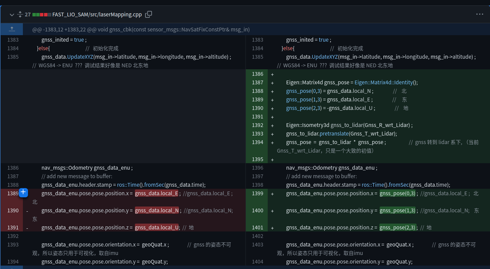

# FASTLIO-SAM update log

Thank you for your stars. I updated some of the codes according recent issures. 

## 2022.12.9 update 

commit 2d0a041ef776a52b2c4a4f6e66bf576804c4de45

1. If you find mapping process is too slow, you can optimize the compilation process in CMakeLists.txt.

2. Livox ros driver is deleted, if you need, you can add the driver yourself.

## 2022.12.22 update

1. remove a typo.

2. Nullptr:

## 2023.12.27 update

1. Coordinate transformation in LIO-SAM parking dataset, GNSS should be NEX

​			  																																															   edited by kaho 2023.12.27